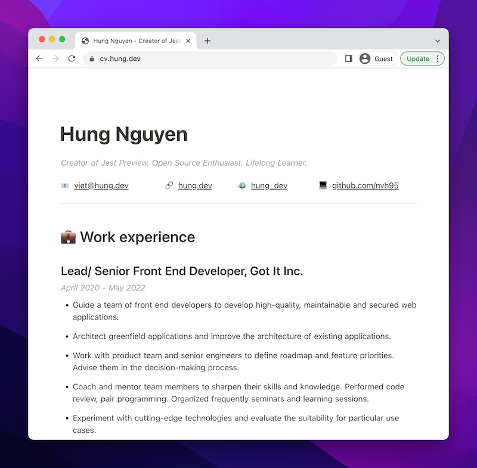

💼 Hung Nguyen Resume

Online Resume: https://cv.hung.dev

I used Notion to manage my Resume (https://hung.dev/cv). However, loading a Notion page is too slow. So, I decided to use Nuxt to generate a static version of my Notion-based CV, which is available at https://cv.hung.dev

It uses `nuxt` and `vue-notion` as the core packages.
